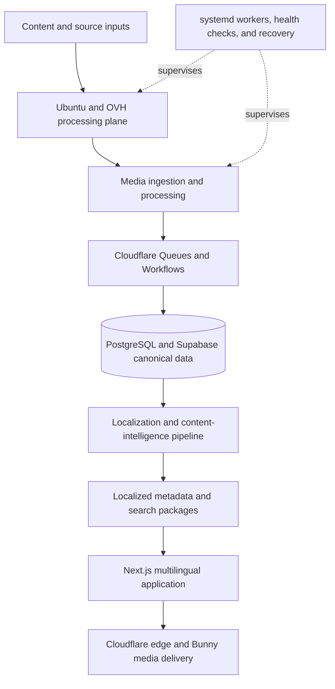

# Private Multilingual Media Discovery & Processing Platform

A private commercial media platform combining source processing, structured metadata, AI-assisted localization, multilingual discovery, and edge delivery across approximately 30 locale and language-market experiences.

**Status:** Private commercial project; actively developed.  
**Source:** Private. This case study represents two private repositories as one system.

## The System Problem

Operating a multilingual discovery product requires more than translating interface strings. Each title, description, search package, metadata record, canonical relationship, and product route must remain coherent across language markets while media ingestion and processing continue independently.

The system was designed around that separation of concerns: a source-processing plane prepares media, workflow infrastructure moves jobs through the platform, canonical data remains centralized, and a multilingual application turns localized metadata into searchable product experiences.

## Architecture

## Localization and Content Intelligence

The approximately 30-locale architecture is not a literal translation layer. It coordinates:

- localized titles, descriptions, and metadata
- language-market-specific search and discovery packages
- canonical relationships between shared source records and localized representations
- consistent routing and frontend behavior across locales
- AI-assisted localization contracts and processing workflows

The objective is to keep localized discovery useful while preserving a stable canonical data model underneath it.

## Processing and Operations

The source-processing plane runs on Ubuntu infrastructure hosted at OVH. Its verified operational surface includes nginx, PHP-FPM, MariaDB components where applicable, supervised systemd workers, health and recovery mechanisms, and restricted network access patterns using SSH hardening, UFW, and fail2ban.

At the edge and data layers, Cloudflare Workers, Hyperdrive, Queues, and Workflows coordinate ingestion and asynchronous processing around PostgreSQL/Supabase data. Bunny infrastructure handles media delivery, while the Next.js application provides multilingual search, discovery, and localized content surfaces.

## Engineering Highlights

- Clear separation between media processing, canonical metadata, localization, discovery, and delivery
- Queue- and workflow-driven processing for operations that should not block user requests
- High-level recovery and worker supervision for a self-hosted processing plane
- Locale-aware product architecture designed around search and metadata quality, not only interface translation
- Mixed edge, managed database, CDN, and Linux/VPS infrastructure joined into one operational system

## Technology

TypeScript, Next.js, PostgreSQL, Supabase, Cloudflare Workers, Hyperdrive, Queues, Workflows, AI/model integrations, Bunny media delivery, Ubuntu/OVH, nginx, PHP-FPM, MariaDB components, systemd, and hardened host/network configuration.

## Privacy and Commercial Boundary

The product name, market-specific branding, source code, production data, prompts, credentials, operational addresses, and proprietary processing details are intentionally omitted. No explicit sample content is included in this case study.
