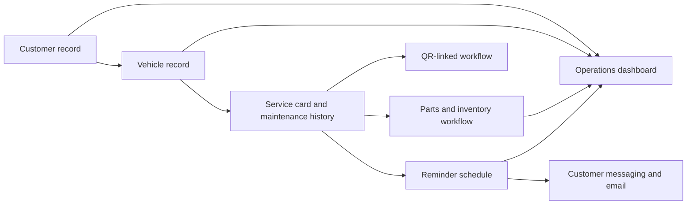

# Oto Yasin Operations Platform

A custom automotive service operations platform developed around the day-to-day workflow of a real client business.

**Status:** Active client system with a private authenticated deployment.  
**Public business website:** [oto-yasin.com](https://oto-yasin.com/)  
**Public website source:** [gokturk078/oto-yasin-landing](https://github.com/gokturk078/oto-yasin-landing)

## Operational Scope

The system connects records and follow-up work that would otherwise be spread across separate documents and manual reminders:

- customer and vehicle records
- maintenance and service schedules
- service history and customer/service cards
- stock and inventory workflows
- reminders and overdue follow-up
- customer email and messaging workflows
- QR-based operational flows
- dashboard and CRM-style day-to-day views

## Workflow

## Implementation

The private application uses Next.js and TypeScript for the product interface and server routes, with Supabase/PostgreSQL for operational records. The implementation also includes QR workflows, scheduled reminder automation, email automation, and Cloudflare/Vercel deployment configuration.

The public Oto Yasin repository is a separate business-facing website. It presents services and contact information; it does not contain the operations platform or its data.

## Engineering Focus

- Modeling customers, vehicles, services, stock, and reminders as connected operational records
- Turning real workshop follow-up needs into repeatable software workflows
- Coordinating scheduled reminders with customer communications
- Keeping the public website and authenticated internal operations system as separate security and product surfaces

## Privacy

The source and production system are private. This case study contains sanitized information only. It includes no customer names, vehicle plates, email addresses, service records, inventory data, credentials, or security-sensitive production details.
