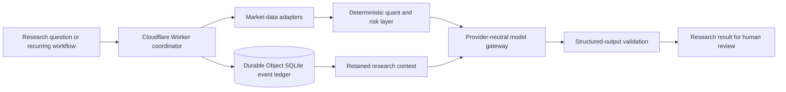

# Trade Agent

Trade Agent is a private personal investment research assistant for structured equity and cryptocurrency research.

**Status:** Private research system.  
**Boundary:** It does not autonomously execute brokerage trades, automatically trade real money, or provide a financial advisory service.

## Why It Exists

Market research often fragments across data providers, one-off model conversations, notes, and repeated manual checks. Trade Agent was built to make that process more systematic: gather market context, retain prior research, run repeatable analyses, and produce structured outputs without delegating risk or execution decisions to a language model.

## System Capabilities

- Equity and cryptocurrency research workflows
- Market-data adapters for external research inputs
- Retained context for prior research and follow-up work
- Durable run and event history using a Cloudflare Durable Object and SQLite ledger
- Deterministic quantitative and risk calculations
- Provider-neutral model access through an OpenRouter-based gateway
- Structured model outputs rather than unbounded free-form responses
- Evaluation fixtures for comparing model behavior on repeatable tasks

## Architecture

There is deliberately no brokerage or order-execution path in this architecture.

## Engineering Decisions

### Durable research context

Research is represented as a sequence of durable events rather than a transient chat session. The SQLite-backed ledger allows later work to refer to prior runs and supports traceable, resumable research workflows.

### Deterministic logic owns numeric controls

The model helps interpret a question and synthesize evidence. Quantitative features and risk-related calculations are handled in deterministic code where reproducibility and explicit rules matter.

### Provider-neutral model integration

Model access sits behind a gateway so research workflows are not coupled to one provider. Structured contracts and evaluation fixtures make provider or model comparisons more disciplined than prompt-by-prompt manual testing.

### Research, not automated trading

The output is material for human review. The system does not connect research conclusions to autonomous brokerage execution and does not make production trading decisions.

## Technology

TypeScript, Cloudflare Workers, Durable Objects, SQLite, React, market-data APIs, OpenRouter/model integrations, schema-validated structured outputs, and automated evaluation fixtures.

## Privacy

Source code, credentials, prompts, holdings, account information, personal investment history, and proprietary research data are not included. This case study is limited to sanitized architectural information.
